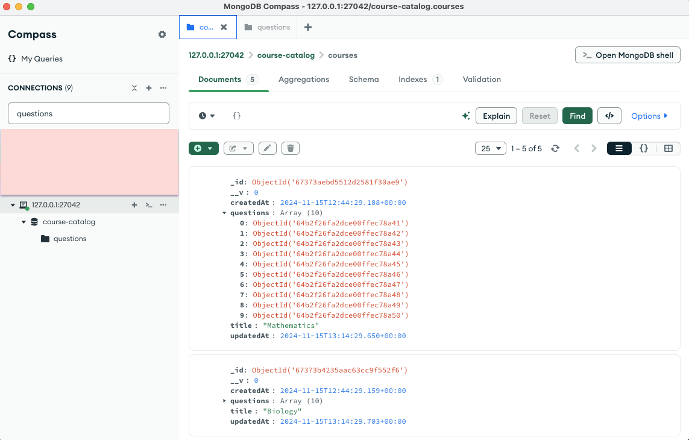
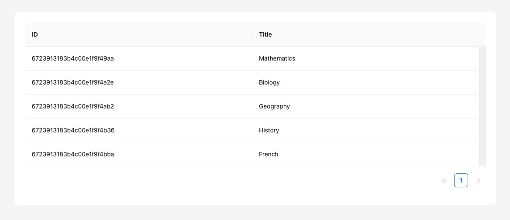
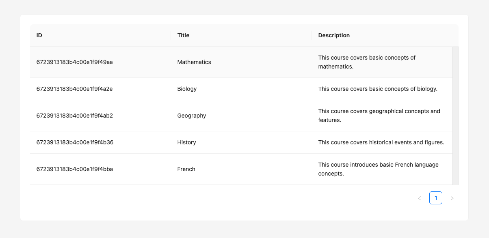
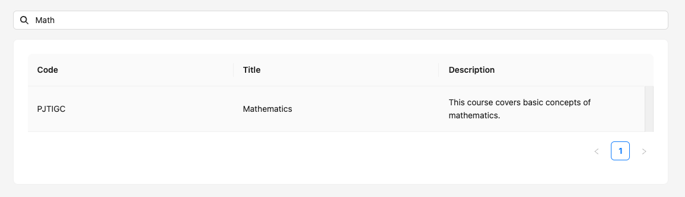

# Fullstack intern test case

## Introduction

The goal of this case is to assess your skills in both frontend (React) and backend (Node.js) development.

At Wooclap, we don't believe in trick exercises where you must guess what we want, because that does not represent how we work on a daily basis. T
herefore, we tried to be as explicit as possible in the instructions. In place where instructions are less precise, 
we expect you to make your own choices and explain them.

If you have any doubt or questions, don't hesitate to email morgan.fauvet@wooclap.com and francois.poire@wooclap.com or to plan a call with us to ask for clarifications. This will not penalize you in any way.

## Submission guidelines

You can submit your work in different ways:
- By sending us a link to a public repository or inviting us to a private repository on GitHub.
- By sending us a zip file containing your project.

If you choose to create a private repository, please invite the following people:

- Julien (Engineering Manager) : https://github.com/jrusso-wooclap
- François (Lead Frontend Developer) : https://github.com/bisonfoutu
- Morgan (Lead Backend Developer) : https://github.com/morganwooclap
- Joseph (Growth Engineer) : https://github.com/Estayparadox
- Thomas (Growth Engineer) : https://github.com/tseil

Please update the `README.md` with your name and any information you think is relevant for us to understand your work.

You should give us access to your finished project at least one full business day before the restitution meeting to leave us some time to review it.

## Prerequisites to run the project

- [x] Having Docker installed on your machine. If not the case, you can get it from this [link](https://www.docker.com/products/docker-desktop/)
- [x] Having an IDE like [VSCode](https://code.visualstudio.com/download) or [Webstorm](https://www.jetbrains.com/webstorm/) installed on your machine

> [!NOTE]
> This is optional, but we advise you to have a way to browse your MongoDB database. Here are a few suggestions:
>
> - [MongoDB Compass](https://www.mongodb.com/try/download/compass)
> - [Studio 3T](https://robomongo.org/download)
> - Webstorm has a built-in MongoDB client from version 2024.3
> - VSCode has a MongoDB extension too: https://www.mongodb.com/products/tools/vs-code

## Run the project on your localhost

- Start Docker Desktop on your machine

- Launch the Docker container from the project

  ```bash
  docker compose up -d
  ```

- Install dependencies

  ```bash
  npm install --prefix apps/api
  npm install --prefix apps/web
  ```

- In a new terminal, start the backend API

  ```bash
  npm run start:api
  ```

> [!NOTE]
> The Mongo database is empty when you start the server.
>
> To populate some data in it, please run the following command in a terminal:
>
> ```
> npm run seed
> ```

- API should run on port `3000`
- You can test the API by going to `http://localhost:3000/api/health`
- You can check the state of your MongoDB database with your MongoDB client, using the connection string that's available in `server.js`



- In another terminal, start the frontend WEB

  ```bash
  npm run start:web
  ```

If both the API and web app run as expected, you should see the following content:



If for whatever reason you don't have this result, please read through all the steps described above once more.

If you really can't get the project to work, don't hesitate to contact us, we'll do our best to help you sort things out.

## Before starting

_We are aware that the use of AI nowadays can be a full-fledged tool that can assist you in completing this technical case._

_We are not opposed to the use of this tool if it is helpful to you._

_However, if this is the case, we ask that you be transparent about its use when submitting your test. We may ask you questions about your understanding of the answers provided by the AI._

_If you wish, you can also share your ChatGPT session with us, including all your exchanges. This could help us better understand your reasoning and way of working._

## Now, let's start !

As stated above, you start with a basic web app that displays a list of courses, with their ID and name.

You'll gradually add more features to this app, allowing users to view and interact with the courses.

> [!NOTE]
> We tried to make as many steps independent as possible, so you can skip some of them if you encounter difficulties.  
> Of course, we expect you to complete as many steps as possible, but we don't want you to be blocked by a single step and have to give up on the whole test.

### Step 1 - add a description

#### Backend

We would like to add a description to the courses.  
This description should have a limit of 256 chars.

> [!NOTE]
> Once you have added the `description` property, you can populate data again by running the seed with the command:
>
> ```
> npm run seed
> ```

#### Frontend

We now want that description to appear as a third column in the courses list page.  
Update the `Course` model and the `CourseList` component to display this new column.

You should end up with this result:



### Step 2 - hide unnecessary data

#### Backend

Some of the data that's stored in DB are useless for the client so we would like to avoid returning these data in the API.  
Update the API code to return only the following information when call `GET /api/courses`

```json
{
  "_id": "672cba3267f16b1cce31904f",
  "title": "General Chemistry: Principles and Applications",
  "description": "An overview of fundamental chemistry concepts such as atomic structure..."
}
```

### Step 3 - use a human-readable identifier

#### Backend

We don't want to expose the technical `_id` to teachers, because it's not a human-readable identifier for a course.  
We would instead like to generate a random `code` of 6 letters for each course.

Update the Course logic in the API to implement this new `code` property.  
Your implementation will need to follow these constraints:

1. The `code` is provided by the API when:
   - We list the courses.
   - We get the details of a course.
2. We can not modify this `code` via the API update endpoints.
3. The `code` property is indexed by MongoDB so we can efficiently use it to search for courses.
4. The `code` should be unique.

> [!NOTE]
> Once you have added the `code` property, you can populate data by running the seed with the command:
>
> ```
> npm run seed
> ```

#### Frontend

Now that the API also sends a `code` for each course, replace the `id` by this new `code` in the course list.

### Step 4 - search for a course

#### Backend

We would like to quickly and easily retrieve a course.
To do it, we would like to provide an API endpoint able to search courses by their `code` or their `title`.

The search logic should follow these rules:

- The search should be case-insensitive.
- The search should be a partial match: you can get results by typing any part of the course `code` or `title`.

You can implement search either by updating the endpoint `GET /api/courses` or by creating a new, specific endpoint.

#### Frontend

Now that you have a working search endpoint, it's time to use it to search in the list of courses.  
Uncomment the search input above the list of events and implement the search logic to use your newly implemented search API endpoint.

To keep the page simple, we'll avoid adding a search button and send the request to the API on each keystroke.

You should end up with this result:



### Step 5 - course detail page

#### Frontend

You may have already noticed that clicking on a course moves you to a new page and displays a 404 error.  
Add the missing routing logic to display the course detail page when clicking on a course.

Since we don't want to expose the technical `_id` to teachers, we will use the `code` to identify the course in the URL.  
Update the existing redirection logic to use the `code` instead of the `_id`.

> [!NOTE]
> If you didn't complete step 3, you can still use the `_id` to identify the course in the URL.

### Step 6 - display course questions

We would like to display the course title, description and its list of questions.

Since we previously removed the unnecessary data from the courses list API response, we'll need to call the API again to get the course's questions.

#### Backend

Remember we chose not to expose technical IDs to users ? This means we'll need to have a way to fetch the course by its code.

Please update the API endpoint `GET /api/courses/:courseId` to load the detail of a course by its code.

> [!NOTE]
> If you didn't complete step 3, also skip the backend part for this step (step 6).

#### Frontend

Fetch the course details using the logic you just implemented.

> [!NOTE]
> If you skipped the backend part for this step (step 6), you can still use the `_id` to fetch the course details.

Then, display the course title, its description, its list of questions and a button to go back to the list of courses.

You should end up with this result:


### Step 7 - edit course questions

#### Frontend

Now, modify the course details page to open an edition modal when clicking on a question in the list.  
This modal should allow the user to edit the question's name and choices.

The API already provides the necessary endpoint to update a question. Find which one it is, and use it to save the edited data.

### Step 8 - duplicate a question

Creating questions can be time-consuming for our users. We would thus like to give them the possibility to duplicate an existing question in a specific course.

Implement the following API endpoint:
`PUT /api/courses/:courseId/questions/:questionId/duplicate`

Now, add a duplicate button on each question in the course detail page.  
When clicking on this button, the question should be duplicated in the same course and the duplicated question should appear immediately in the list.

### Step 9 - log all requests

For monitoring purposes, we want to log all the requests which are made to our API.

Update the API codebase to log the content of each request that the API receives, following the instruction below:

1. A simple `console.log` is enough for logging.
2. Each log, needs to include:
   - the request's HTTP method.
   - the request's URL, including query parameters.
   - the request's body, if present.
